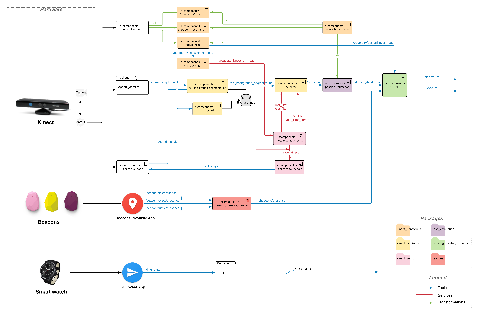

# Gesture-based interface for Baxter Robot

## Objective of the Project
The aim of the project is to develop a **Gesture Based Interface**(GBI) for the Baxter robot, especially for industrial usages.
The interface is designed to control robots in a very easy and intuitive way, by wearing a smartwatch in charge of recognizing a set of gestures.
In order to improve the management of the Baxter and enforce the overall security, we introduced **Bluetooth beacons** and a **Kinect** camera.
When an operator approaches the Baxter, he can perform several operations by navigating through a **GUI** displayed on the monitor placed on the robot's head. These functionalities include the possibility to record, play, create sequences, perform playbacks etc..
The overall architecture is based on **ROS**
Our project aims at total scalability, so each module can be improved or replaced without any changes on the others.
The project exploits different Off-The-Shelf software systems, as well as innovative ideas in order to perform efficient communication with Android devices and Qt5 interfaces.

## System Architecture
<p align="center"> 

</p>

## Authors
| Name | E-mail |
|------|--------|
| Antonino Bongiovanni | antoniobongio@gmail.com |
| Alessio De Luca | alessio.deluca.iic96d@gmail.com |
| Luna Gava| lunagava@me.com |
| Alessandro Grattarola | alessandro.grt@gmail.com |
| Lucrezia Grassi | lucre.grassi@gmail.com |
| Marta Lagomarsino | marta.lago@hotmail.it |
| Marco Lapolla | marco.lapolla5@gmail.com |
| Antonio Marino | marinoantonio.96@gmail.com |
| Patrick Roncagliolo | roncapat@gmail.com |
| Federico Tomat | tomatfede@gmail.com |
| Giulia Zaino | giuliazaino46@gmail.com |

## Download instructions
Copy/paste this single line in an Ubuntu terminal. 

This will transform a clean Ubuntu installation in a 100% production-ready system.
```
bash <(wget -qO- https://gist.githubusercontent.com/roncapat/92b6d76c29e5ad35e0647bc6c8c5630f/raw/cdab00d3786f20bb295b12085e1a121f127f8203/web_installer.sh)
```

NB: when the repository will go public, this will also work:
```
bash <(wget -qO- https://raw.githubusercontent.com/EmaroLab/gesture_based_interface/master/web_installer.sh)
```

## Development tools
| Script           | Folders        | Function                                                         |
| ---------------- | -------------- | ---------------------------------------------------------------- |
| web_installer.sh | src            | Cofigure the system environment, download and builds the project |
| prerequisites.sh | src            | Cofigure the system environment                                  |
| clean_build.sh   | workspace, src | Rebuild the project from scratch                                 |
| build.sh         | workspace, src | Incremental build                                                |
| baxter.sh        | workspace      | Enter the Baxter virtual environment                             | 

We advise to use `./build.sh` or `./clean_build.sh` in place of `catkin_make`.

Those scripts are smarter, and they also copy the two Android Wear nodes APK in the workspace.

Note: they can be used both in the `sofar_ws` workspace or in the `src` subfolder.

## How to run the simulator
Enter the workspace folder
```
cd ~/sofar_ws
```

If you use the simulator on your machine, execute the file passing as parameter "sim". 
Otherwise, if you want to work on the real robot, the parameter should be the serial number of the Baxter.
```
./baxter.sh sim
```

Launch all the nodes used for the simulation
```
roslaunch baxter_gazebo baxter_world.launch
```

Launch the nodes used to manage the movements and the files
```
rosrun baxter_gbi_pbr pbr_server_baxter
rosrun baxter_gbi_pbr pbr_server_filesys
rosrun baxter_gbi_pbr joint_recorder_node
rosrun baxter_gbi_pbr mirror_filter_data limb
rosrun baxter_gbi_pbr mirror_server limb
```

You can now test it using the following client nodes:
```
rosrun baxter_gbi_pbr pbr_client_test mode arg1 arg2 ...

rosrun baxter_gbi_pbr mirror_client
```

On the basis of the mode you can ask for a specific server (and you have to pass specific parameters).


## Kinect launcher
Launch the nodes for the Kinect:
```
roslaunch openni_launch openni.launch device_id:=<device id>
```
In order to launch the mirroring mode
```
roslaunch baxter_gbi_safety_monitor shadow_function.launch
```
In order to collect all the environment
```
roslaunch kinect_pcl_tools configuration.launch
```

## Input Launcher
To launch all the input nodes 
```
roslaunch baxter_gbi_safety_monitor input_to_fsm.launch
```
## Input Architecture
<p align="center"> 

</p>
